# How to configure git connection

I have to say that this article was written using GitLab as an example; in other systems, including GitHub, the actions are exactly the same.

Before starting to contribute to the git repository, you should start to configure the communication with GitLab. Let's assume that the GitLab account has already been created and we have access from the web.

Click on your profile icon and go to Preferences:

  <p align="center">
  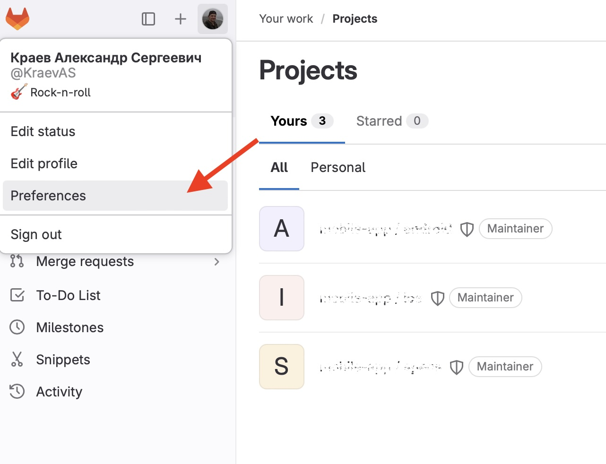
  </p>

We need for the tab Access Tokens for configuring access via https, or the tab SSH Keys for configuring access via ssh:

  <p align="center">
  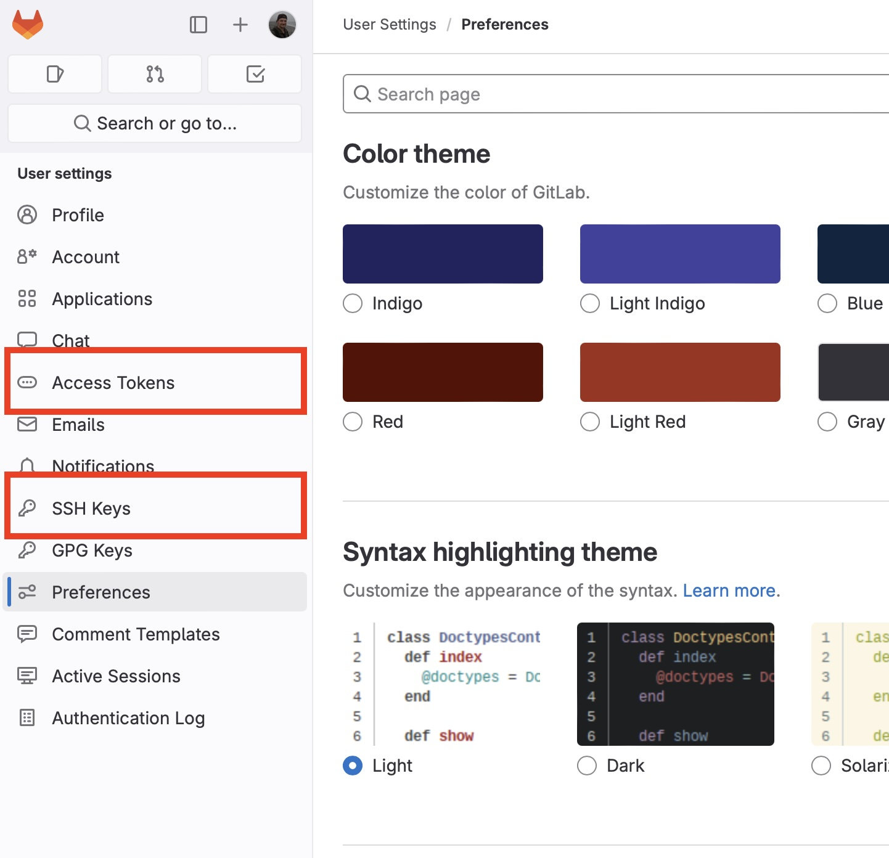
  </p>  


Let's take a look at both variants.


## Using SSH keys to communicate with GitLab

GitLab uses the SSH protocol to securely communicate with Git. When you use SSH keys to authenticate to the GitLab remote server, you don’t need to supply your username and password each time.

SSH uses two keys, a public key and a private key.
- The public key can be distributed.
- The private key should be protected.

These files are not transferred during authentication; the server only verifies that the owner of the public key also owns the private key. But how?


* The client publish the public key on the server.
* The server generates and sends a short random message asking the client to sign it with a private key.
* The SSH agent on the client side sign the message and send the result back to the server.
* The server verifies the signature using the client's public key.
* After this the server has a proof that the client owns the private key.

This algorithm is based on the public-key cryptography.

To use SSH to communicate with GitLab, you need 

- The OpenSSH client, which comes pre-installed on macOS.

- SSH version 6.5 or later. Earlier versions used an MD5 signature, which is not secure.

To view the version of SSH installed on your system, run ssh -V.

```shell
ssh -V
```

  <p align="center">
  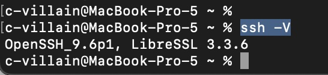
  </p>  

If OpenSSH is missing on your system, you can install it using package manager. 
Now let’s generate a pair (public and private keys). Run the command in the console:

```shell
ssh-keygen -t ed25519 -C "this is my comment" 
```

`-t ed25519` - is a digital signature based on the [Edwards-curve Digital Signature Algorithm (EdDSA)](https://en.wikipedia.org/wiki/EdDSA). ed25519 is used by the default. To communicate with GitLab, you can use the following SSH key types: dsa, ecdsa, ecdsa-s, ed25519, ed25519-sk, rsa.

`-C "this is my comment"` - the comment. Looking ahead, I have to say that this comment is added to the end of the file with the public key. This flag is optional.

  <p align="center">
  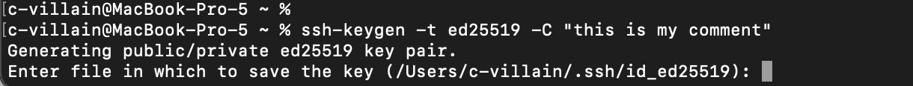
  </p>  

  In the next step you should choose the path to the folder for saving keys and name for files. You may use for default path and name (its written in the brackets).

  В скобках предложенное название (это будет алгоритм выбранной цифровой подписи) и путь, которые можно использовать по-умолчанию. I advise you not to change the path (from the example above `/Users/your user/.ssh`). For the name of files you may use your company title, e.g. `gitlab.myorg.ru`:

  <p align="center">
  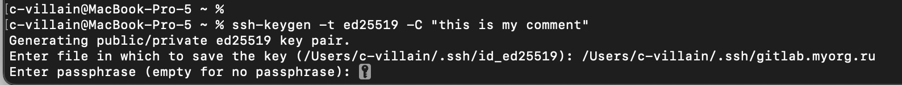
  </p>  

In the next step you will be asked to set a passphrase (or password) for the key. This is necessary for additional protection if a potential attacker gains access to your computer. Note that if you set a passphrase, you will need to enter it every time you log in. On the other hand, to avoid this, you can safely store the phrase using the SSH agent.

I recommend you not to set the passphrase.

  <p align="center">
  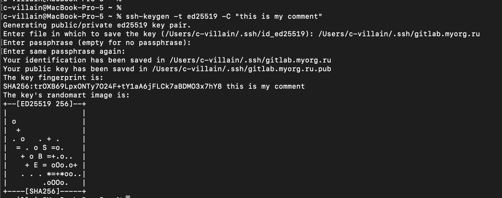
  </p>  

A pair of keys has been generated! Let's look at them =) Let's go to the specified folder, in my case it is `/Users/c-villain/.ssh`:

 <p align="center">
  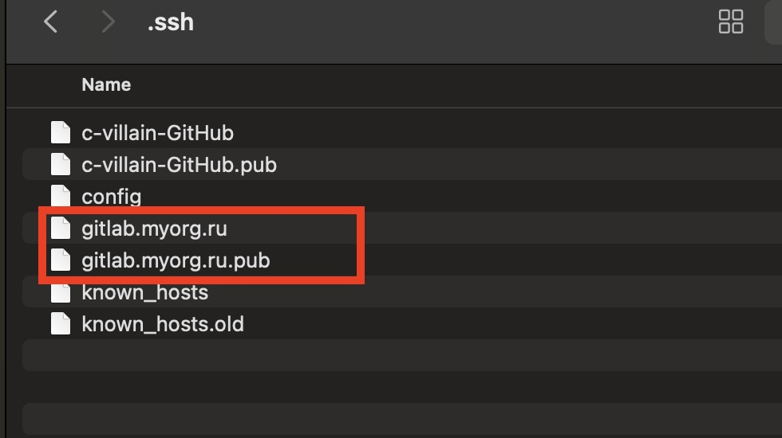
  </p>  

  The file with the .pub-extension contains the public key, the other file contains the private key. Let's open the file with the public key using Sublime:


 <p align="center">
  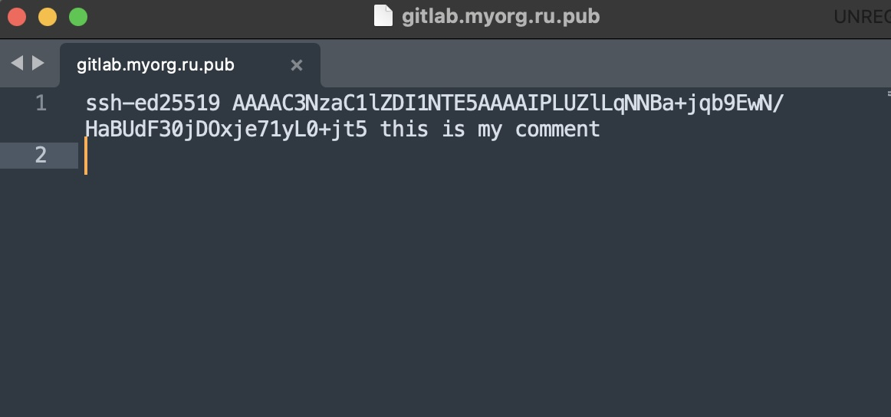
  </p>  

At the end of the file we can find for the our comment we left during the generation a pair of keys. At the beginning of the file there is a signature algorithm note.

The file with the secret key:

 <p align="center">
  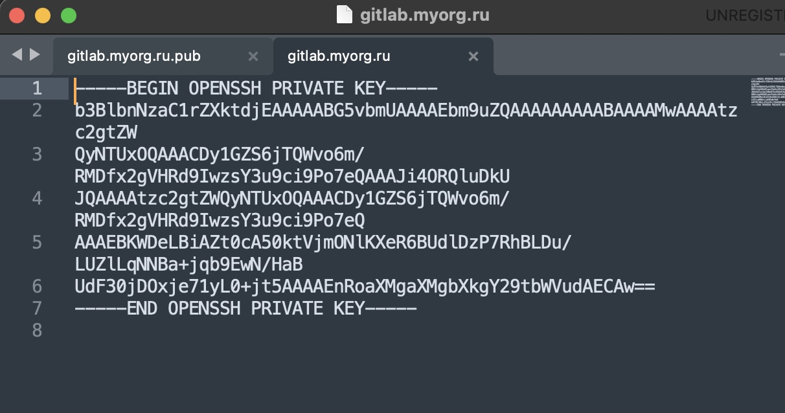
  </p> 

The next step is to add the secret key to the SSH agent. This is done with the following command:

  Теперь необходимо добавить секретный ключ в SSH-агент. Run the command in the console:
 
 ```shell
 ssh-add ~/.ssh/gitlab.myorg.ru 
 ```

where `~/.ssh/gitlab.myorg.ru` is the path to the file with secret key. 

 <p align="center">
  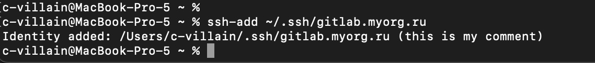
  </p> 

I have to say that if you decide to enter for the passphrase during the generating a pair of keys, you should run the command in the console with flag `--apple-use-keychain`:

 ```shell
ssh-add --apple-use-keychain ~/.ssh/gitlab.myorg.ru 
 ```

  <p align="center">
  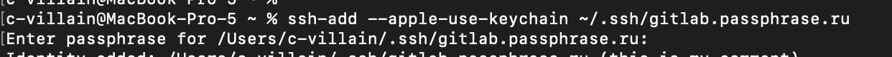
  </p> 

You will need to enter the secret phrase in the console so that the key is registered in the SSH agent.

Now you need to copy your SSH public key and go to GitLab. Go to the SSH Keys section and click the "Add key" button:


  <p align="center">
  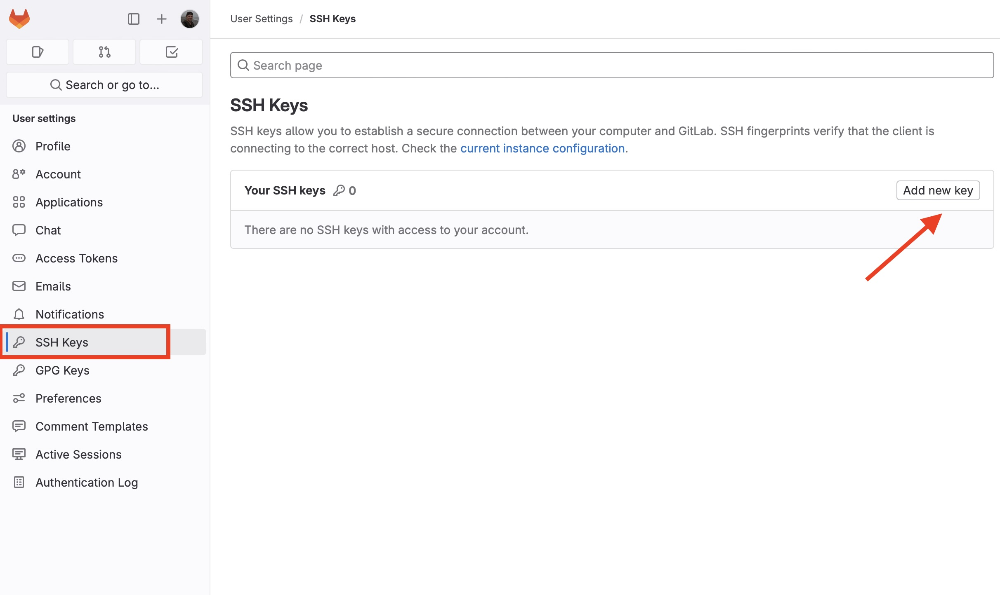
  </p> 

  Paste the public key in the textfield:

  <p align="center">
  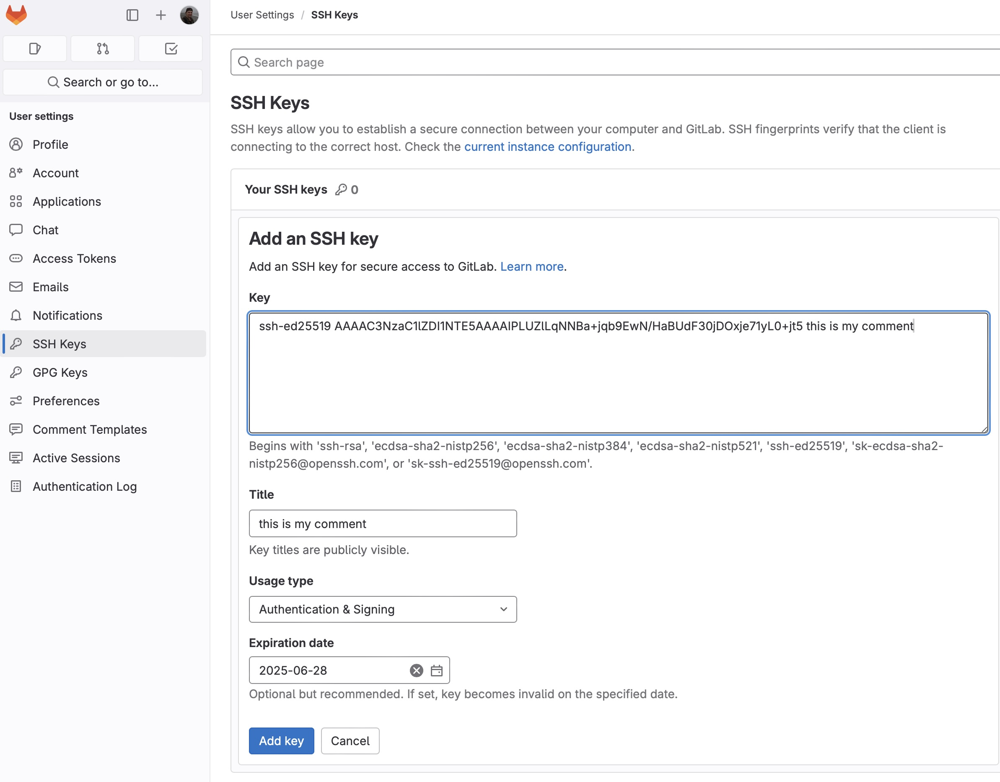
  </p> 

You can name the key in GitLab as you want in the Title by defaults the comment is inserted there. The expiration date of the key is optional, actually it may be the requirements of the cybersecurity department. Let's add a key by clicking "Add key":

  <p align="center">
  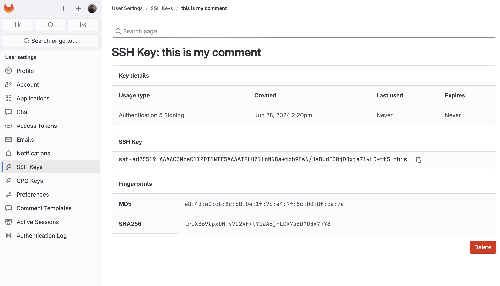
  </p> 

The key has been successfully registered. After refreshing the page with SSH Keys section we'll see:

  <p align="center">
  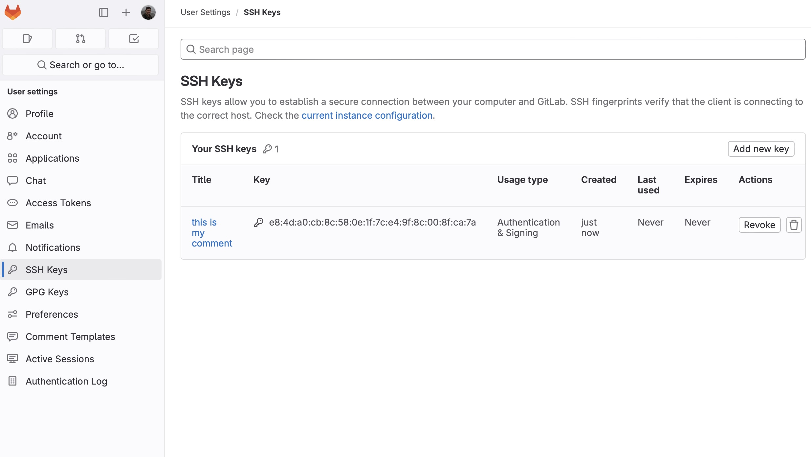
  </p> 

When you run `git clone` use the path from “Clone with ssh” in the Code menu:

 <p align="center">
  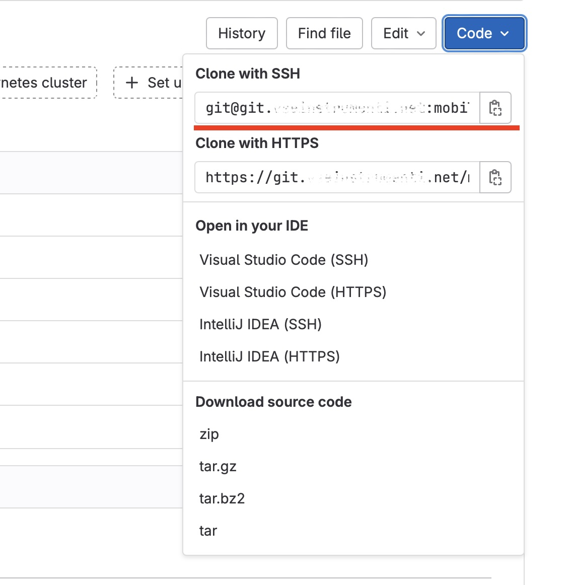
  </p>

It looks like this:

  <p align="center">
  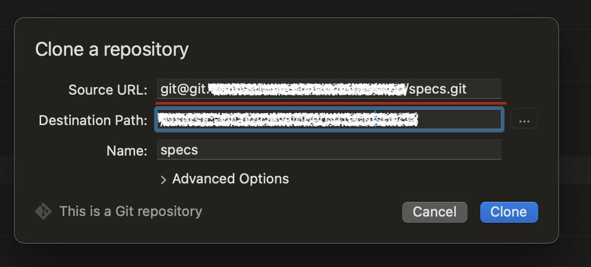
  </p>


## Using Access Tokens to communicate with GitLab

The regular way to communicate with GitLab is https. It is quite simple. You need to provide an access token. Go to Access tokens section in Preferences and click "Add new token":

 <p align="center">
  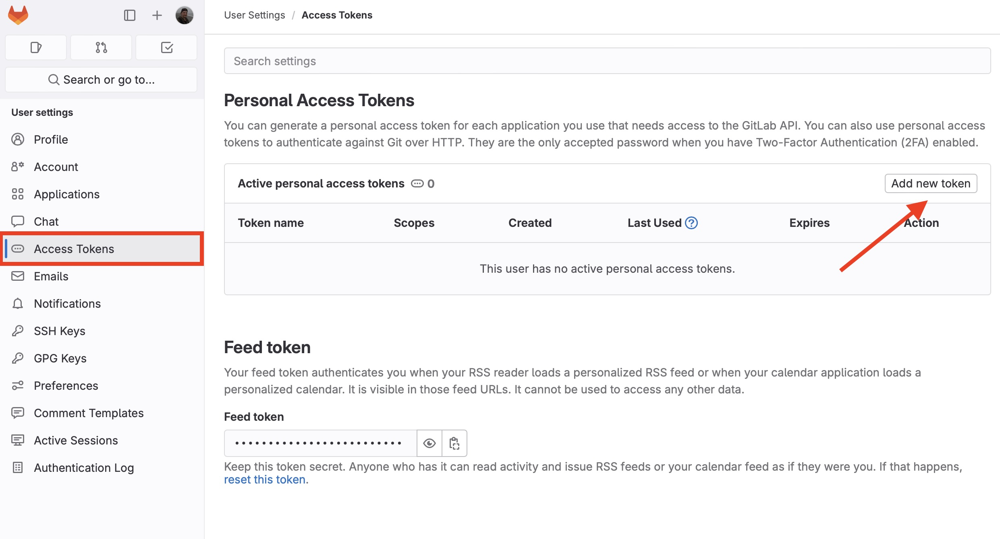
  </p>

  Name your token, e.g. Access. If it is necessary, you may edit the expiration date. Select the permission levels granted to the token, at least read_repository and write_repository:

 <p align="center">
  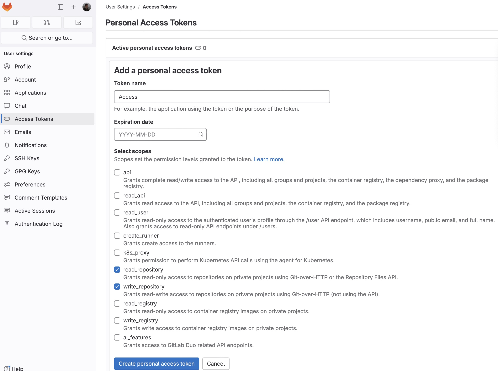
  </p>

  Click "Create personal access token":

 <p align="center">
  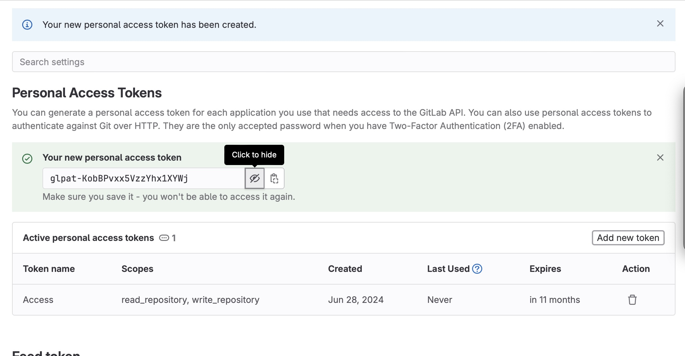
  </p>

On the next page, by clicking on the “eye” icon, you may see the generated token. You should copy and save it.

When you run `git clone` use the path from “Clone with HTTPS” in the Code menu:

<p align="center">
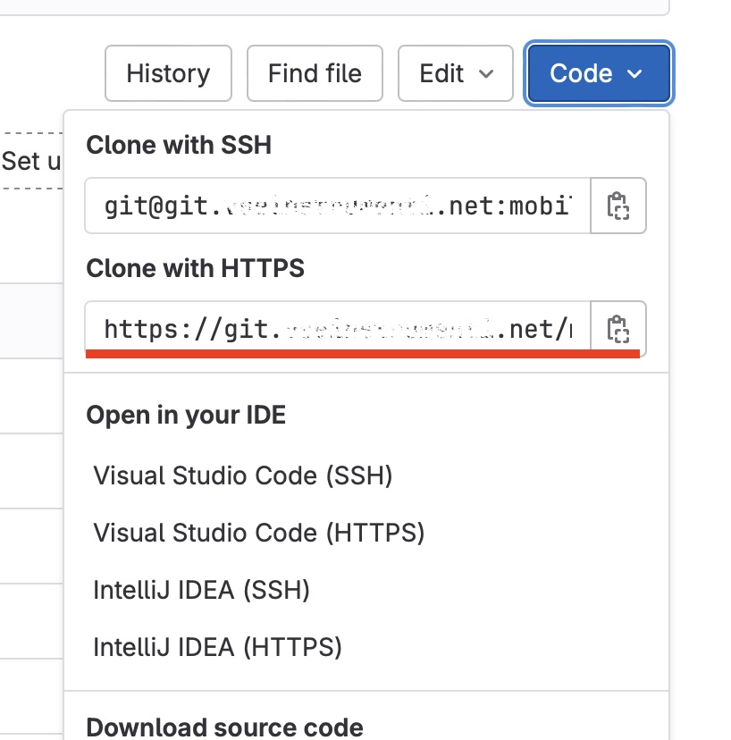
</p>

After asking for login and password, enter the login (GitLab user) and this token as a password:

  <p align="center">
  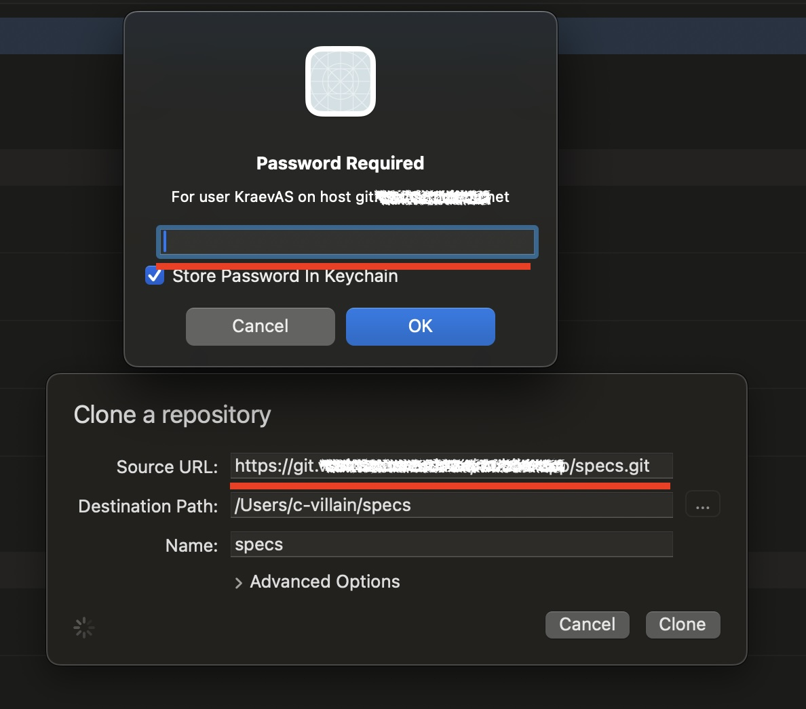
  </p>

That's all 👌🏻 
