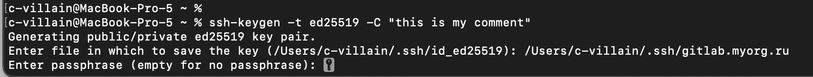
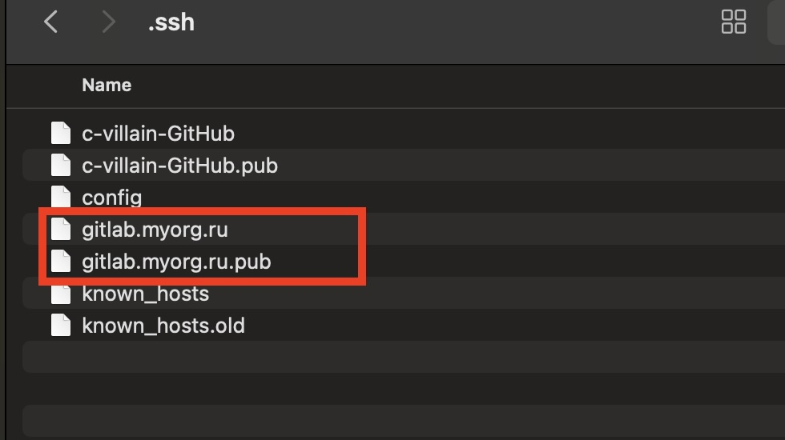
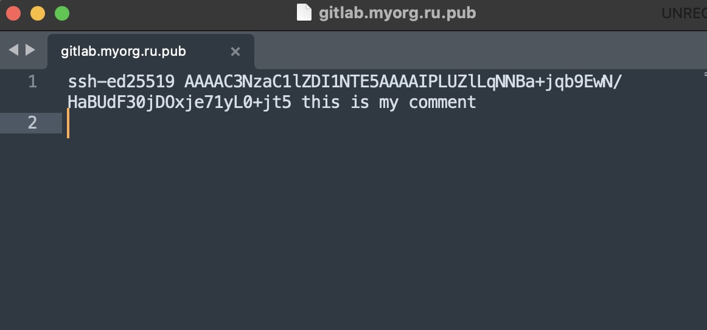
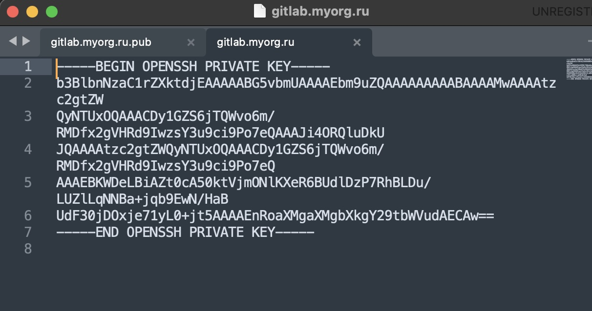
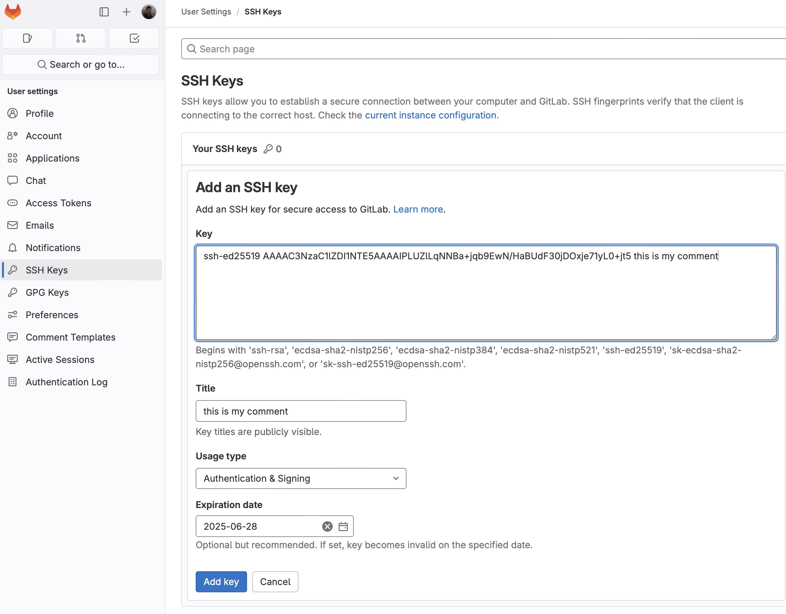
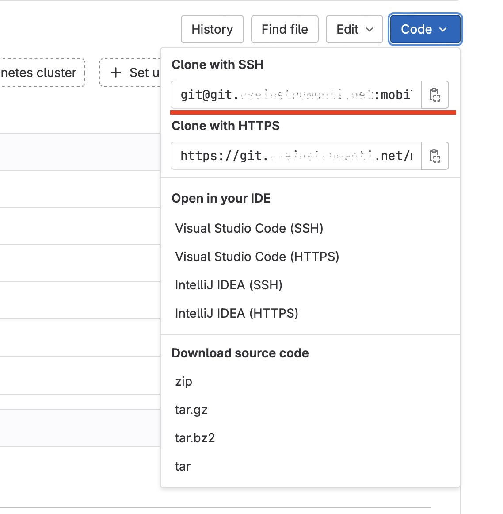
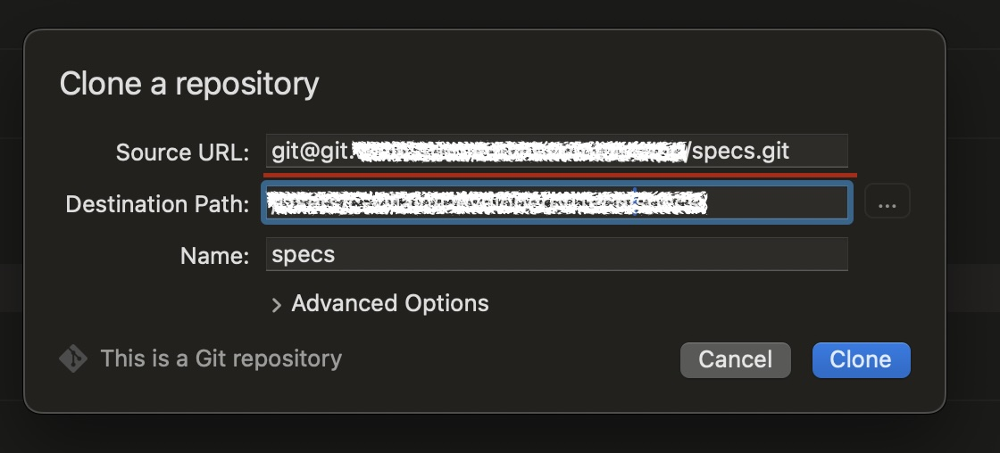
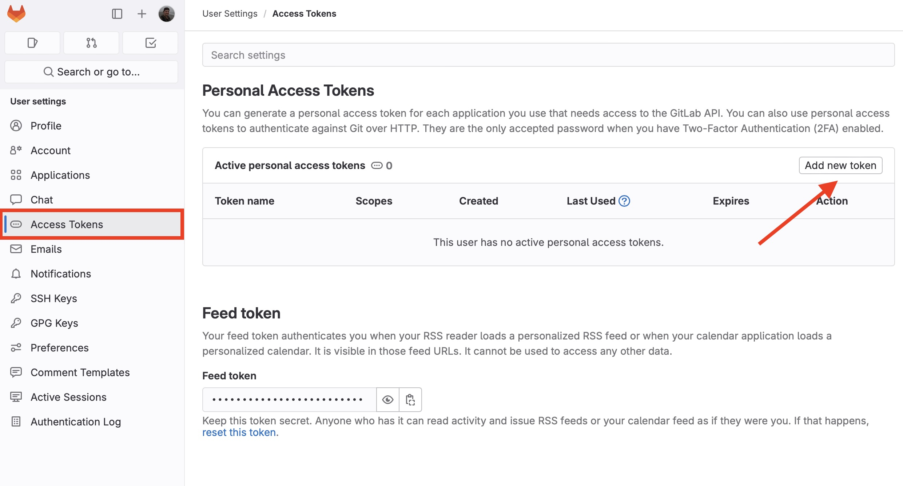
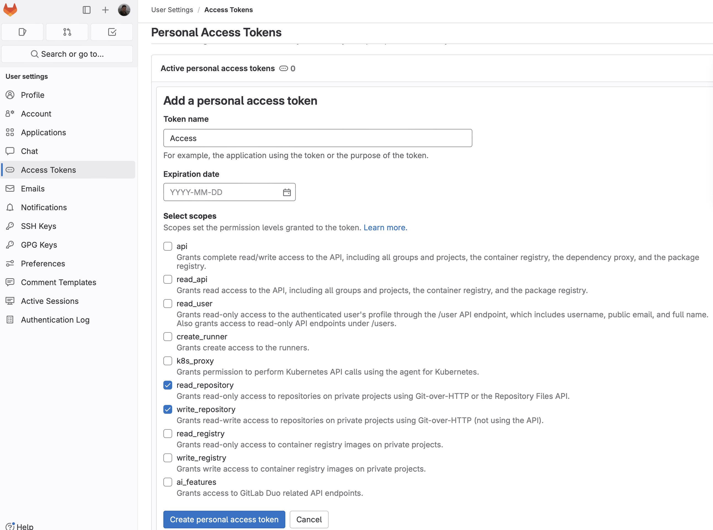
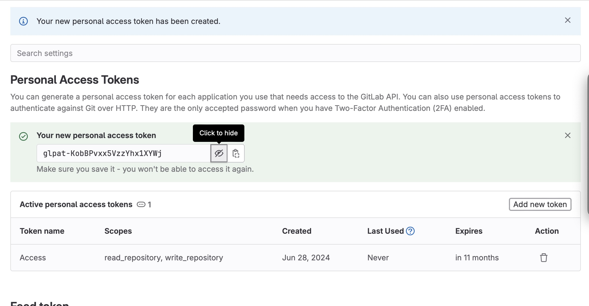

# Настраиваем подключение к гиту со своей рабочей станции.

Сразу оговорюсь, что данная статья написана на примере gitlab-а, в других системах, в том числе и GitHub, действия ровно те же.

Для того, чтобы начать контрибьютить в репозиторий гита, необходимо настроить доступ со своей рабочей станции. Предположим, что сам аккаунт в gitlab-е уже создан и у нас есть доступ из web-а.

Кликнув по иконке своего профиля, идем в Настройки / Preferences:

  <p align="center">
  
  </p>

  Здесь интересна вкладка Access Tokens, если хотим настроить доступ через https, или SSH Keys, если хотим использовать ssh.

  <p align="center">
  
  </p>  

Мы рассмотрим оба варианта.

## Подключение через SSH.

Один из способов подключения к гитлабу - по протоколу SSH. Подробно о нем рассказывать не буду (вы можете прочитать в любой другой статье), скажу лишь, что это безопасное соединение, в котором аутентификация происходит по ключевой паре. Для этого предварительно генерируется открытый и закрытый ключ. На машине, с которой требуется произвести подключение, хранится закрытый ключ, а на удалённой машине— открытый. Эти файлы не передаются при аутентификации, система лишь проверяет, что владелец открытого ключа также владеет и закрытым. Каким же образом?

Вот как проверяется ключ пользователя во время SSH-соединения, с точки зрения сервера:

* Клиент предоставляет серверу публичный ключ.
* Сервер генерирует и отправляет короткое случайное сообщение, прося клиента подписать его с помощью приватного ключа.
* Клиент просит агента SSH подписать сообщение и пересылает результат обратно на сервер.
* Сервер проверяет подпись, используя публичный ключ клиента.
* Теперь у сервера есть доказательство того, что клиент владеет приватным ключом.

Данный алгоритм основан на криптографии с открытым ключом. 

Для начала проверим, что SSH установлен. Чтобы просмотреть версию SSH, установленную в системе, необходимо запустить следующую команду:

```shell
ssh -V
```

  <p align="center">
  
  </p>  

 Пакет OpenSSH входит в большинство дистрибутивов ОС по умолчанию. Если по какой-либо причине он отсутствует в вашей системе, вы можете установить его при помощи вашего пакетного менеджера.
Теперь сгенерируем пару (открытый-закрытый ключ), для этого в консоли выполним команду:

```shell
ssh-keygen -t ed25519 -C "this is my comment" 
```

-t ed25519 - это схема цифровой подписи (на основе эллиптической кривой Эдвардса), которая используется для генерации открытого ключа. ed25519 используется по-умолчанию. Поэтому этот параметр можно не указывать, я лишь показываю, что схему можно выбрать. Другие варианты: dsa, ecdsa, ecdsa-s, ed25519, ed25519-sk, rsa.

-C "this is my comment" - это любой комментарий для вас. Забегая вперед, скажу, что этот комментарий добавляется в конец файла с открытым ключом. Вы можете не указывать его, я привык вписывать туда название проекта и окружение, кто-то указывается рабочую почту.

  <p align="center">
  
  </p>  

  Далее необходимо выбрать, куда сохранить пару и название файла. В скобках предложенное название (это будет алгоритм выбранной цифровой подписи) и путь, которые можно использовать по-умолчанию. Советую путь (/Users/ваш пользователь/.ssh) не менять, а название использовать такое, чтобы вы сами в первую очередь не запутались, какой ключ для какого гита и проекта используется.  Я привык указывать указывать в названии гитлаб организации, для примера укажу gitlab.myorg.ru:

  <p align="center">
  
  </p>  

  Далее вам будет предложено задать кодовую фразу (или пароль) для ключа. Это нужно для дополнительной защиты, если потенциальный злоумышленник получит доступ к вашему компьютеру. Обращаю внимание, что если задать кодовую фразу, ее потребуется вводить при каждой авторизации. С другой стороны, чтобы этого избежать, вы можете безопасно сохранить фразу в SSH-агенте, но об этом позже. 

Я советую оставить фразу пустой:

  <p align="center">
  
  </p>  

  Пара ключей сгенерировалась! Посмотрим на них =) Перейдем в указанную папку, в моем случае это /Users/c-villain/.ssh:

 <p align="center">
  
  </p>  

Файл с расширением .pub содержит публичный или открытый ключ, во втором файле секретный ключ. Заглянем внутрь файла с публичным ключом:

 <p align="center">
  
  </p>  

  Да, здесь в конце строки видим как раз наш комментарий, указанный при генерации, а в начале - используемый алгоритм подписи. 

В файле с секретным ключом: 

 <p align="center">
  
  </p> 

  Теперь необходимо добавить секретный ключ в SSH-агент. Делается это следующей командой:
 
 ```shell
 ssh-add ~/.ssh/gitlab.myorg.ru 
 ```

где ~/.ssh/gitlab.myorg.ru - это путь до вашего файла с секретным ключом. 

 <p align="center">
  
  </p> 

  Если на этапе генерации пары ключей вы все же решили добавить кодовую фразу, то эту команду надо запускать с флагом --apple-use-keychain:

 ```shell
ssh-add --apple-use-keychain ~/.ssh/gitlab.myorg.ru 
 ```

  <p align="center">
  
  </p> 

  Нужно будет повторить секретную фразу в консоли, чтобы ключ прописался в SSH-агенте.

Теперь копируем весь публичный ключ и идем в гитлаб, раздел SSH Keys, нажимаем кнопку добавить ключ:

  <p align="center">
  
  </p> 

  В текстовое поле копируем публичный ключ:

  <p align="center">
  
  </p> 

  В поле Название (Title) по-умолчанию подставился тот самый комментарий, вы можете назвать ключ в гитлабе как хотите. Срок окончания действия ключа (Expiration date) опционален, его можно и вовсе не указывать. В зависимости от требований отдела кибербеза срок действия ключей может быть ограничен. Добавим ключ, нажмем Add key: 

  <p align="center">
  
  </p> 

Ключ успешно прописан. При повторном заходе в раздел SSH Keys мы видим:

  <p align="center">
  
  </p> 

Когда будете клонировать проект по ssh, то используйте путь “Clone with ssh” в меню Code:

 <p align="center">
  
  </p>

  В клиенте это выглядит так:

  <p align="center">
  
  </p>

 ## Подключение через HTTPS

Второй способ подключиться к гиту - использовать https. Он же самый простой. Здесь, чтобы авторизоваться, необходимо запровайдить токен доступ. Идем в Access tokens в Preferences и нажимаем Add new token:

 <p align="center">
  
  </p>

  Указываем название токена, например, Access, если нужно ограничиваем срок действия токена в Expiration date, и указываем необходимые права: как минимум, read_repository и write_repository, чтобы можно было пушить ваш код и читать из репозитория:

 <p align="center">
  
  </p>

  Нажимаем Create personal access token:

 <p align="center">
  
  </p>

  В открывшемся окне, нажав на иконку “глаза”, можно посмотреть на сгенерированный токен, копируем его и сохраняем.

Когда будете клонировать проект по ssh, то используйте путь “Clone with HTTPS” в меню Code:

 <p align="center">
  
  </p>

  Теперь идем в гит клиент. При клонировании репозитория с проектом, клиент потребует ввести логин (это пользователь в гитлабе) и пароль, сюда и вводим токен:

  <p align="center">
  
  </p>

  На этом все, мы рассмотрели два способа настройки гита, ваш клиент настроен. 
