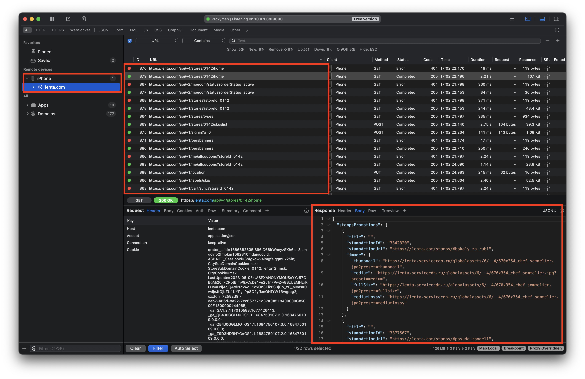

# SSL Пиннинг

HTTP - широко распространённый протокол передачи данных, изначально предназначенный для передачи гипертекстовых документов (тех, которые могут содержать ссылки, позволяющие организовать переход к другим документам).

В соответствии со спецификацией [OSI](http://en.wikipedia.org/wiki/OSI_model), HTTP является протоколом прикладного (верхнего, 7-го) уровня. 

Протокол HTTP предполагает использование клиент-серверной структуры передачи данных. Клиентское приложение формирует запрос и отправляет его на сервер, после чего серверное программное обеспечение его обрабатывает, формирует ответ и передаёт его обратно клиенту.

Но, как известно, протокол HTTP передает данные в открытом виде, то есть любой человек в сети может прослушать трафик и прочитать все сообщения, которыми обмениваются стороны:

  

  
  

  Выше, на скриншоте, представлен пример такого прослушивания трафика через http, когда сниффером перехвачен запрос и ответ от ресурса. В качестве сниффера используется Proxyman, но можно выбрать любой другой (Charles, Wireshark и т.п.).

На самом же деле сейчас уже уже тяжело найти сайт/мобильное приложение с соединением по http. Более того, в iOS по-умолчанию запрещено использовать подключение по http, включить его можно только применив соответствующую настройку в plist-файле.

Для того, чтобы предотвратить возможность чтения и модификации запросов, поверх обычного HTTP добавили SSL и появился протокол HTTPS, где буква S расшифровывается как Secure, то есть безопасный. При HTTPS соединении все данные зашифровываются и расшифровать их могут только те, кому они предназначены (отправляющая и принимающая стороны).

  

  
  

  На скриншоте выше представлен результат соединения, например, с [lenta.com](https://lenta.com) по https. Как мы видим, трафик уже зашифрован, нежели это было как в случае с http. 

Итак, SSL и TLS - это протоколы для защищенной передачи данных. TLS является усовершенствованной версией SSL. Эти протоколы содержат в себе различные шифронаборы (Cipher Suites), которые можно использовать для осуществления операций шифрования.

Шифронабор - это некоторая строка вида “TLS_DH_RSA_WITH_AES_256_CBC_SHA256”, которая определяет, с использованием каких алгоритмов и по каким правилам будет осуществляться общение клиента и сервера. Давайте разберем по порядку, что за чем следует и что за что отвечает, - понимание этого потребуется нам в дальнейшем.
* Protocol (TLS) – Протокол, по которому осуществляется соединение, а именно TLS или SSL.
* Key Exchange (DH) – Алгоритм, по которому осуществляется обмен ключами. Это может быть RSA / DH (Диффи Хелман) / DHE (эфемерный Диффи Хелман) / ECDH (Диффи Хелман на эллиптических кривых) / ECDHE (эфемерный Диффи Хелман на эллиптических кривых) и другие. 
* Authentication (RSA) – определяет, по какому алгоритму будет проходить аутентификация сторон (RSA / DSA / ECDSA / ...)
* Stream encryption (AES_256_CBC) - определяет, по каким протоколам будет осуществляться шифрование потока. При этом указывается длина ключа и режим (RC4_128 / AES_256_CBC / 3DES_EDE_CBC / ...)
* Message Authentication (SHA256)- определяет, каким алгоритмом будет осуществляться подпись сообщений (MD5 / SHA / SHA256 / ...)

Резюмируя, можно сказать, что SSL использует асимметричную криптографию (ассиметричные шифры) для обмена ключей шифрования и симметричную криптографию (симметричные шифры) для шифрования трафика на ключах, полученных шагом ранее. 

Схематично процес установки защищенного соединения клиента (handshake)  с сервером можно изобразить следующим образом:

  

  
  

  Что происходит на схеме:

1. Чтобы соединиться с сервером, клиент отправляет ему некоторый Hello-запрос. Условно, он говорит: “Привет сервер, я хотел бы начать с тобой общение“.
2. На сервере хранится пара ключей: приватный ключ (который никак нельзя компрометировать) и публичный ключ. В ответ на запрос клиента, сервер отправляет ему свой сертификат, в котором содержится его публичный ключ.
3. Клиент на своей стороне вырабатывает предварительный секрет (большое случайное число), шифрует его на публичном ключе сервера, и этот зашифрованный секрет отправляет по сети серверу.
4. Сервер, используя свой приватный ключ, расшифровывает предварительный секрет, и обе стороны независимо друг от друга вырабатывают Главный секрет.
5. После того, как на обеих сторонах имеется одинаковый главный секрет, вырабатываются сеансовые ключи. На их основе уже и происходит шифрование данных. С этого момента защищенное соединение считается установленным и можно начинать передавать данные.

Теперь давайте посмотрим, какая информация содержится в сертификате [lenta.com](https://lenta.com).
  1. В браузере нажмем на кнопку с замком и выберем Show connection details (пункт Connection is secure):

  

  
  

  2. После выберем пункт Certificate is valid. 
  
   

  
  

  3. Открылось окно Certificate Viewer (просмотрщик сертификатов). Для удобства просмотра сразу сделаем экспорт сертификата:

   

  
  

  4. Откроем сертификат в программе Xcode:
  
    

  
  

  На скриншоте выше: 1 - на какую организацию выдан сертификат (Лента), 2 - кем выдан сертификат (компанией GlobalSign), 3 - время жизни сертификата, 4 - тот самый публичный ключ для обмена ключами шифрования из п. 2 описания работы рукопожатия.

Ниже можем видеть список доменов, подключение к которым можно использовать данный сертификат:

   

  
  

 ## Атака “Man In The Middle”

“Man In The Middle” (MITM) - вид [атаки](https://ru.wikipedia.org/wiki/%D0%90%D1%82%D0%B0%D0%BA%D0%B0_%D0%BF%D0%BE_%D1%81%D1%82%D0%BE%D1%80%D0%BE%D0%BD%D0%BD%D0%B8%D0%BC_%D0%BA%D0%B0%D0%BD%D0%B0%D0%BB%D0%B0%D0%BC) в [криптографии](https://ru.wikipedia.org/wiki/%D0%9A%D1%80%D0%B8%D0%BF%D1%82%D0%BE%D0%B3%D1%80%D0%B0%D1%84%D0%B8%D1%8F) и [компьютерной безопасности](https://ru.wikipedia.org/wiki/%D0%9A%D0%BE%D0%BC%D0%BF%D1%8C%D1%8E%D1%82%D0%B5%D1%80%D0%BD%D0%B0%D1%8F_%D0%B1%D0%B5%D0%B7%D0%BE%D0%BF%D0%B0%D1%81%D0%BD%D0%BE%D1%81%D1%82%D1%8C), когда злоумышленник тайно ретранслирует и при необходимости изменяет связь между двумя сторонами, которые считают, что они непосредственно общаются друг с другом. Главным образом это атака на канал связи, при которой злоумышленник находится в одной сети с вами и обладает контролем над точкой доступа, или каким-то образом может перенаправить вас на свой прокси-сервер внутри сети. Злоумышленник для клиента представляется конечным сервером, а для сервера - клиентом. Он стоит “посередине“ между ними и способен читать и модифицировать трафик, проходящий через него.

   

  
  

 ### Процесс атаки.

Если рассмотреть процесс подключения клиента (мобильного приложения) к своему серверу через подконтрольную точку доступа у злоумышленника, то он будет выглядеть так:
1. Приложение обращается к своему серверу через точку доступа, подконтрольную злоумышленнику. 
2. На этой точке доступа развернут Proxy-сервер, через который проходит весь трафик.
3. При запросе на соединение со своим сервером, Proxy “представляется” конечным адресатом, и в ответ на клиентский SSL-запрос возвращает свой собственный сертификат со своим публичным ключом.
4. Клиент генерирует и зашифровывает предварительный секрет или генерирует пару ключей и обменивается ими с сервером злоумышленника, а не со своим. 
5. Таким образом, защищенное подключение устанавливается именно со “зловредным“ сервером и он, как принимающая сторона, видит весь трафик. 
6. С другой стороны, Proxy “представляется“ клиентом для целевого сервера и осуществляет с ним обмен данными, фактически, становясь “посредником“ между клиентом и сервером.

Разумеется, эту схему реализовать непросто. Более того, ключевым условием является то, что сертификат корневого центра сертификации Proxy-сервера, на основе которого генерируются сертификаты, отправляемые клиенту, обязательно должен быть доверенным на устройстве пользователя. При этом не важно, что это будет за девайс - компьютер, планшет или смартфон.

Все же сознательно, продемонстрируем данную атаку. В качестве, proxy-сервера будет выступать сниффер трафик Proxyman. 

Для начала, и это же самое главное, необходимо установить и доверить сертификат Proxyman, который сможет подменять сертификат общения клиента с сервером. 
Инструкцию как это сделать можно найти по этим пунктам меню, которые показаны на скриншот ниже:

 

  
  

  Сама инструкция:

 

  
  

Выполним шаги по инструкции. Вначале обратим внимание, что сертификата сниффера нет на устройстве:

  
  

  Теперь, когда сертификат установлен на устройстве и является доверенным, можем включить SSL проксирование для домена lenta.com в сниффере:

  

  
  

  Видим, что атака успешно проведена:

   

  
  

  Теперь, трафик можем “читать”: мы видим как все запросы от клиента к серверу, так и ответы.
Но по какому сертификату происходит рукопожатие клиента с прокси-сервером, который выступает в роли “человека посередине”? Посмотрим на него здесь: 

  
  

  Обратим внимание на детали, которые полностью изменились:

  

  
  

  1 - все по-прежнему тот же ресурс, с которым мы хотим установить безопасное соединение, а вот пункт 2 - корневой центр сертификации уже другой, теперь это уже наш сниффер Proximan. Кроме того, 3 - публичный ключ также поменялся, это публичный ключ сниффера.

Каким образом происходит работа? Внутри Proxy-сервера есть свой собственный сертификат, который выступает в роли корневого центра сертификации. Когда через прокси проходит обращение на какой-то адрес (в данном случае адрес Ленты), прокси это понимает, “на лету“ выпускает сертификат именно для того домена, на который было обращение, подписывает его своим корневым сертификатом и отдает его клиенту. Клиент принимает сертификат с публичным ключом, проверяет, что доменные имена совпадают, и продолжает процедуру установки защищенного соединения.

Чтобы вся эта схема работала, необходимо выполнение одного обязательного условия - на устройстве клиента должно быть безоговорочное доверие корневому центру сертификации от Proxy-сервера. Другими словами, пользователь должен согласиться и поставить на свой девайс некоторый сертификат и доверять ему. Сертификат мы доверили на этапе эмуляции атаки.

Вообще, процесс доверения сертификатов кажется чем-то особенным, но на самом деле это происходит часто. Один из примеров - корпоративные устройства или корпоративные сети, для подключения к которым обязательно установить сертификат.

Другой, более интересный способ заставить пользователя поставить нужный сертификат - прибегнуть к помощи фейковых точек доступа и Captive-порталов. С такими порталами пользователи сталкиваются при попытке использовать какую-либо публичную сеть. Когда мы нажимаем “подключиться“, открывается страничка с просьбой, например, ввести свой номер телефона и проверочный код из СМС, или посмотреть рекламу, или что угодно еще.

Таким образом, попасть под сниффинг трафика можно достаточно просто.

## Защита канала связи, или SSL Pinning

В качестве защиты мобильного приложения от подобных атак применяют механизм, который называется SSL Pinning. SSL Pinning призван решать одну единственную задачу - защищать клиента, если он вдруг попал в недоверенную/скомпрометированную сеть, если кто-то пытается прослушать его трафик и т.д. Все остальные плюсы (например, защита от ботов) от SSL Pinning являются следствием этой задачи.

А теперь немного о том, что же собственно такое SSL Pinning, как он устроен и как его применять. Суть этого метода в том, чтобы на этапе SSL Handshake после второго шага, когда сервер присылает нам свой сертификат с открытым ключом, приложение проверяло, что определенные параметры этого сертификата совпадают с тем, что ожидает получить приложение (то есть, некоторые данные, которые “зашиты“ в приложении и которые мы ожидаем получить от своего сервера).

### Типы SSL Pinning

#### Certificate Pinning
Первая реализация - это Certificate Pinning. Проверяется непосредственно сам сертификат, включая метаданные (кому он выдан, срок окончания, данные владельца и т.д.). При такой реализации чувствительны абсолютны все данные в сертификате, поскольку даже небольшое изменение в них вызовет несоответствие и приведет к невозможности установить соединение.
Но у сертификата есть срок действия, поэтому каждый раз, когда выпускается новый сертификат, должна выходить новая версия приложения.

#### Public key Pinning
Это упрощенная реализация. В процессе проверяется только открытый ключ вместо всего сертификата. Поскольку обновление сертификата возможно без изменения открытого ключа, такой способ позволяет не выпускать обновление приложения каждый раз при смене сертификата. Но условием должно быть то, что при выпуске сертификата не должен смениться публичный ключ.

В мобильных приложениях (iOS и Android)  реализован Public key SSL Pinning, таким образом, в случае смены сертификата нет необходимости в обязательном релизе приложения с вложенным новым сертификатом (или прописанным новым отпечатком в plist), если в сертификате НЕ произошла смена публичного ключа.
Посмотрим, как работает данная защита:

  
  

  Пропуская трафик через Proxyman с установленным и доверенным сертификатом, “прослушать” трафик не получается. Проблемы, ожидаемо, возникают на втором шаге SSL рукопожатия, так как публичный ключ, зашитый в сертификате Proxyman, не соответствует публичному ключу  сертификата lenta.com. Таким образом, снифферу приходиться просто “пропускать трафик напрямую”, не имея возможности его расшифровать путем подмены оригинала сертификата.

Учитывая реализации SSL Pinning в мобильных приложениях, как правило, минимально необходимым договориться о следующем: 
1. Оповещать о выпуске нового сертификата команду мобильной разработки.
2. Учитывая промежуток между релизами мобильных приложений сделать процесс ротации сертификатов длительностью не менее месяца. Это значит, что текущий на данный период времени сертификат оставался актуальным или резервным не менее месяца. 
3. Проверку сертификата на предмет изменения публичного ключа / отпечатка оставить на стороне команды мобильной разработки. 

Дополнительно можно договориться о политике ротации публичных ключей в сертификате.