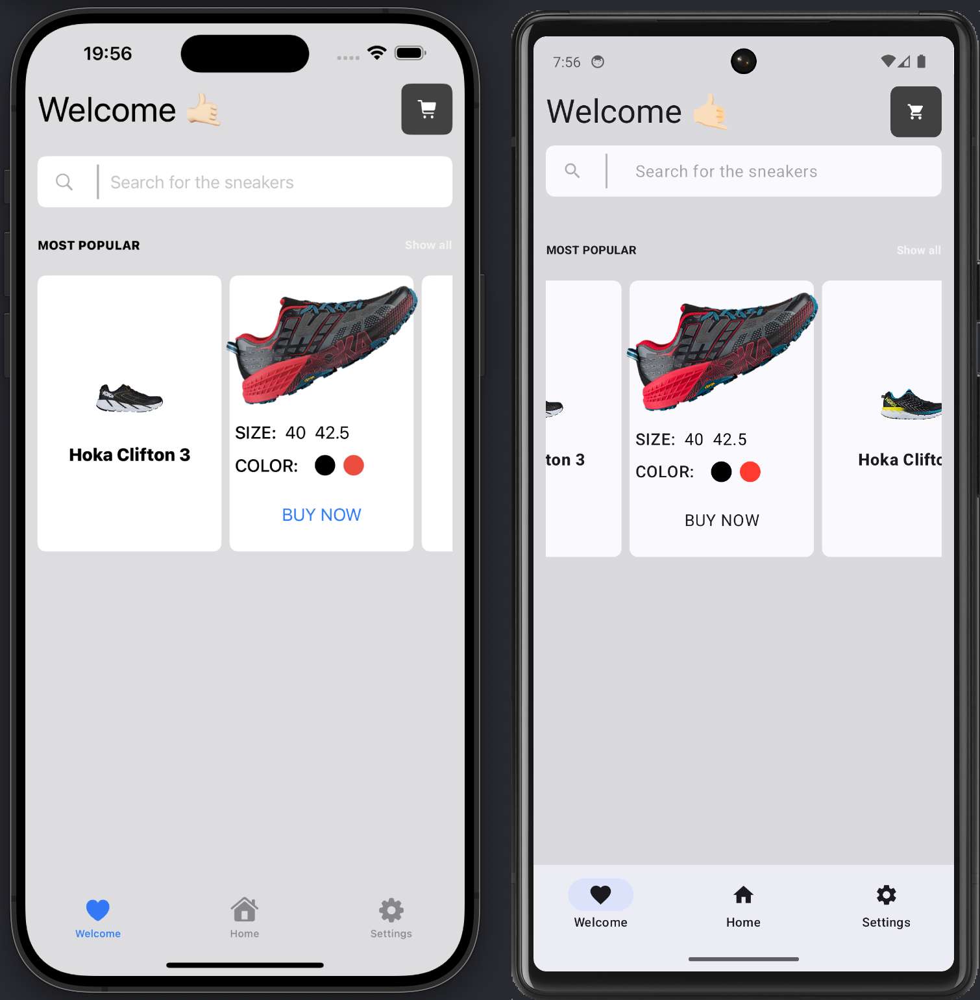

# 🧨 SwiftUI cross-platforming

  
  

The mobile development is divided between iOS and Android. iOS is popular in the West, while Android has more worldwide users.

Neglecting either platform means leaving behind a large percentage of potential users. However, apps are generally made for iOS first. Clients ask for an iOS app, then expect a port to the Play Store. Actually companies design for iOS first, then adapt their designs for Android.

However large tech companies really try to reduce the development time on both platforms. Cross-platform is one of the ways to do it. On my last project we choosed KMM for this. But using KMM-approach you firstly develop for Android-platform and after that you adapt code for iOS. Is there any way to do the opposite? Yes, to use a [Skip](https://skip.tools/).

My demo project is [here](https://github.com/c-villain/SneakerShop).