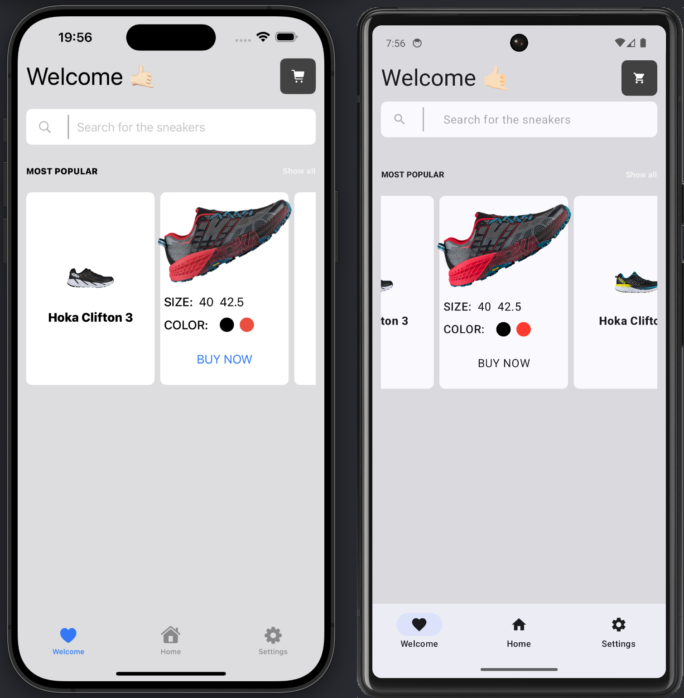

# 🧨 SwiftUI и кроссплатформа

  
  

Мобильная разработка разделена между iOS и Android. iOS популярна на Западе, а у Android больше пользователей по всему миру.

Пренебрежение любой платформой означает отказ от большого процента потенциальных пользователей. За редким исключением приложения сначала создаются для iOS, а значит и дизайн разрабатывается сначала для iOS.

В последнее время крупные компании стараются сократить время разработки на обеих платформах. Кроссплатформенная разработка — один из способов сделать это. В моем последнем проекте мы выбрали для этого KMM. Но, будем честны, используя KMM-подход, вы сначала разрабатываете для Android-платформы, а уже потом адаптируете код для iOS. Но есть ли способ делать наоборот? Да, [Skip](https://skip.tools/).

Мой [демо-проект](https://github.com/c-villain/SneakerShop) с использованием [Skip](https://skip.tools/) [здесь](https://github.com/c-villain/SneakerShop).
