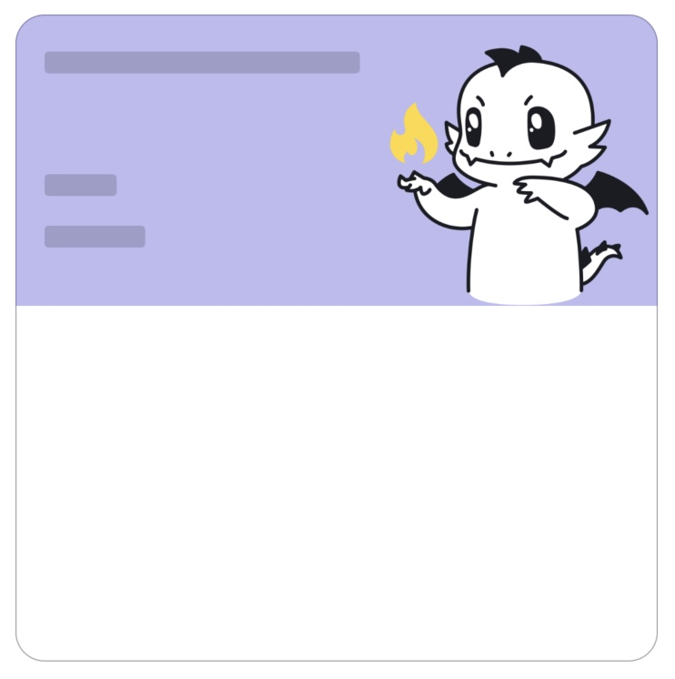
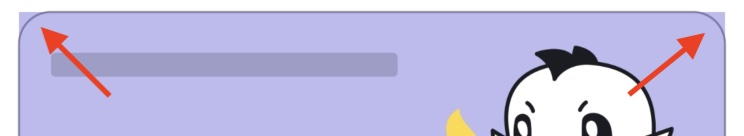

# Why you need custom shapes for your simple SwiftUI views??

<p align="center">
  
  </p>

Hey guys! Let’s get straight to the point.

Ok, we have such design layout:

  <p align="center">
  
  </p>

Quite simple view. I will not dwell on its layout.

The upper half height is dynamic, depending on the content and particularly on the image inside.

  <p align="center">
  
  </p>

Let’s place the indigo and white parts in `VStack`, change the background color of the upper one using `ZStack` and finally draw the gray rounded border around it using `.background`:


```swift
VStack {
    ZStack { 
        Rectangle()
            .fill(.indigo.opacity(0.4))
        ...
    }
    VStack {
        ...
    }
  ...
}.background(
RoundedRectangle(cornerRadius: 16)
.stroke(.gray, lineWidth: 1)
)
```

  <p align="center">
  
  </p>

Let’s classically fix the overflow of the indigo-coloured background using `.cornerRadius(16)`:

  <p align="center">
  
  </p>


```swift
VStack {
 ...
}.background(
    RoundedRectangle(cornerRadius: 16)
        .stroke(.gray, lineWidth: 1)
 )
.cornerRadius(16) // <= look here
```

The final result is really similar to the original design layout:

  <p align="center">
  
  </p>

Seems everything is ok! Later designer suggested to shift the image vertically so that the image would intentionally go beyond the border. Well, let’s add `.offset(y: …)` to the image:

  <p align="center">
  
  </p>

And here we are faced with the side effect of the `.cornerRadius` modifier: it crops the view to which it is applied.

Ok, this would be fixed by applying `.cornerRadius` not to the whole view but only to the `ZStack` with color:

```swift
ZStack { 
    Rectangle()
        .fill(.indigo.opacity(0.4))
        .cornerRadius(16) // <= look here
    ...
}
```

But at the same time the bottom corners are rounded also:

  <p align="center">
  
  </p>

So we need a custom rectangle with only specific corners could be configured as rounded. There is no such in SwiftUI standard shapes.

Ok, let’s draw it ourselves!

The package with this and other ones can be found [here](https://github.com/c-villain/Shapes).

Let’s apply a view extension based on this new shape. You should import the package for this one:


 <p align="center">
  
  </p>

```swift
import Shapes
    ...
ZStack { 
    Rectangle()
        .fill(.indigo.opacity(0.4))
        .cornerRadius(16, corners: .tops) // <= look here
    ...
}
```

Everything is fine now:

 <p align="center">
  
  </p>

  Ok, if you need to crop, you can apply the `.clipped` modifier to the view:

  ```swift
VStack {
    ZStack { 
        Rectangle()
            .fill(.indigo.opacity(0.4))
            .cornerRadius(16, corners: .tops) // look here
        ...
    }
  VStack {
    ...
  }
   ...
}.background(
    RoundedRectangle(cornerRadius: 16)
        .stroke(.gray, lineWidth: 1)
 )
.clipped() // <= look here
  ```

Result will be the same:

   <p align="center">
  
  </p>

  That’s all!✌🏻
