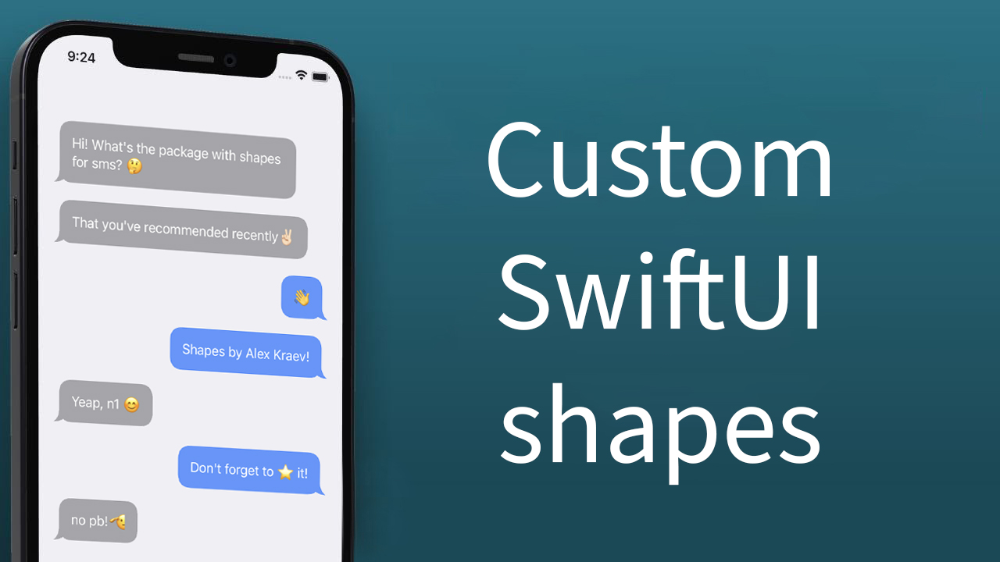
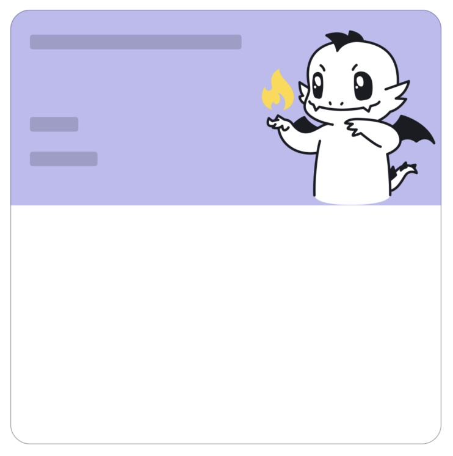
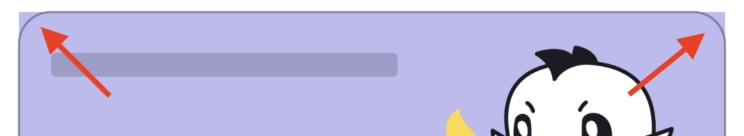
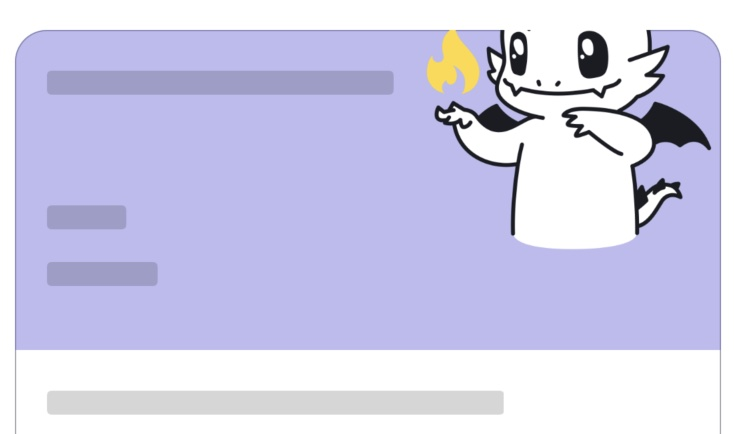
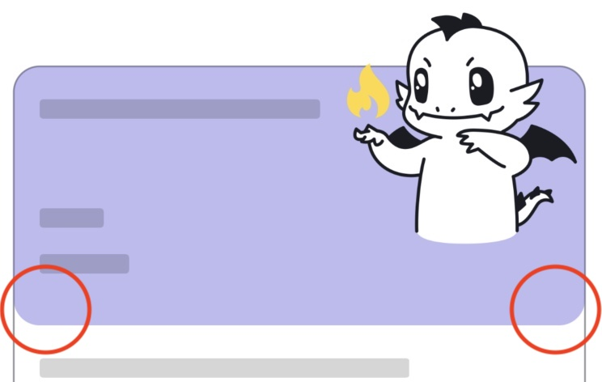
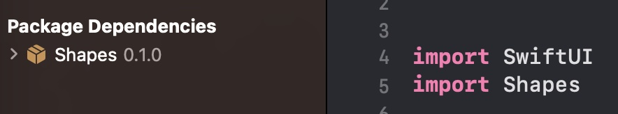
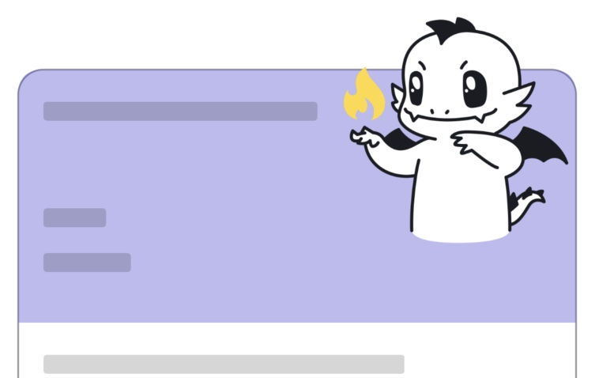

# Зачем нужны нестандартные фигуры (Shapes) в самых обычных SwiftUI View?

<p align="center">
  
  </p>

Давайте сразу к делу.
Есть такой макет.

  <p align="center">
  
  </p>

Не буду подробно останавливаться на верстке, весьма обычный элемент.

Высота верхней половины динамическая, зависит от наполнения и, в частности, от рисунка внутри.

  <p align="center">
  
  </p>

Верхнюю и нижнюю половины поместим в `VStack`, цвет у верхней выкрасим через `ZStack`, серую рамку вокруг сделаем через `.background`:

```swift
VStack {
    ZStack { 
        Rectangle()
            .fill(.indigo.opacity(0.4))
        …
    }
    VStack {
        …
    }
  …
}.background(
RoundedRectangle(cornerRadius: 16)
.stroke(.gray, lineWidth: 1)
)
```

  <p align="center">
  
  </p>

Выход цветной подложки сверху за пределы рамки классически исправляем через `.cornerRadius(16)`:

  <p align="center">
  
  </p>


```swift
VStack {

}.background(
    RoundedRectangle(cornerRadius: 16)
        .stroke(.gray, lineWidth: 1)
 )
.cornerRadius(16) // <= здесь
```

Итоговый результат действительно совпадает с макетом:

  <p align="center">
  
  </p>

И, казалось бы, все хорошо, но позже дизайнер предложил смещать вертикально рисунок, чтобы картинка специально выходила за пределы рамки. Ну что ж, добавим `.offset(y: …)` к изображению рисунка:

  <p align="center">
  
  </p>

И вот сталкиваемся с сайд-эффектом модификатора `.cornerRadius()`: он обрезает вью, к которому он применяется.

Ок, ситуацию исправило бы применение `.cornerRadius` не ко всему вью, а только к `ZStack` с цветом:

```swift
ZStack { 
    Rectangle()
        .fill(.indigo.opacity(0.4))
        .cornerRadius(16) // <= здесь
    …
}
```

Но тогда закругляются и нижние углы у прямоугольника:

  <p align="center">
  
  </p>

  Значит нужен прямоугольник, у которого можно было бы настроить, какие углы закруглять. Из коробки такого нет. Отрисуем сами! Библиотеку с новой и другими фигурами можно найти [здесь](https://github.com/c-villain/Shapes).

 Применим расширение для View, построенного вокруг нового shape, для этого импортируем библиотеку:

 <p align="center">
  
  </p>

```swift
import Shapes
    …
ZStack { 
    Rectangle()
        .fill(.indigo.opacity(0.4))
        .cornerRadius(16, corners: .tops) // <= здесь
    …
}
```

И вот теперь все хорошо:

 <p align="center">
  
  </p>

  А если нужен кроп, то применим модификатор `.clipped` ко всей вью:

  ```swift
VStack {
    ZStack { 
        Rectangle()
            .fill(.indigo.opacity(0.4))
            .cornerRadius(16, corners: .tops) // Здесь
        …
    }
  VStack {
    …
  }
    …
}.background(
    RoundedRectangle(cornerRadius: 16)
        .stroke(.gray, lineWidth: 1)
 )
.clipped() // <= здесь
  ```

  Результат будет тот же:

   <p align="center">
  
  </p>

  На этом все!✌🏻
